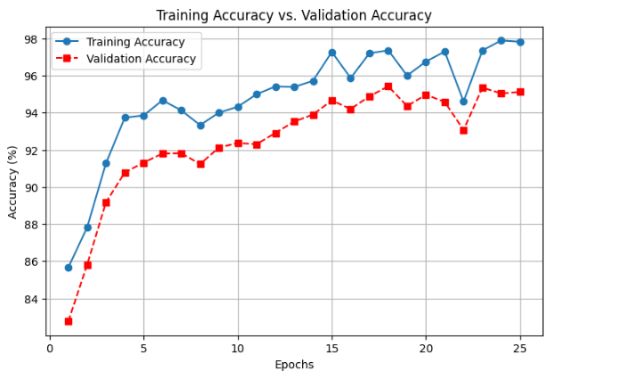
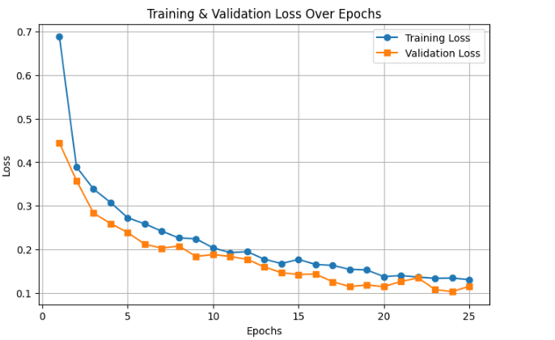
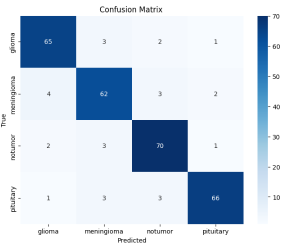

# 🧠 Brain Tumor Classification - Deep Learning Project 📊  

  

## 🚀 Project Overview  
This project focuses on **brain tumor classification** using deep learning techniques. The dataset consists of **four tumor types**:  
- **Glioma**  
- **Meningioma**  
- **No Tumor**  
- **Pituitary**  

With **1,311 medical images**, we train a deep learning model to classify brain tumors effectively.  

---

## 📈 Accuracy Analysis  
The graph above illustrates the **training vs. validation accuracy** over 25 epochs.  
- The **blue line** 🔵 represents **training accuracy**, showing steady improvement.  
- The **red line** 🔴 represents **validation accuracy**, indicating how well the model generalizes.  

### 📊 Key Observations:  
✅ Training accuracy reaches **~98.8%**.  
✅ Validation accuracy stabilizes at **~94.8%**, suggesting strong generalization.  
✅ Slight fluctuations indicate potential **overfitting**, requiring fine-tuning.

---

## 📉 Loss Analysis  
  

- The **blue line** 🔵 represents **training loss**, showing a steady decrease.  
- The **red line** 🔴 represents **validation loss**, indicating the model's ability to generalize.  

### 🔍 Insights:  
✅ Loss decreases significantly in early epochs, indicating proper learning.  
✅ Slight gap between training and validation loss suggests minor overfitting.  
✅ Could benefit from **dropout layers** or **regularization techniques**.

---

## 🔢 Confusion Matrix  
  

### 🧐 Interpretation:  
- The diagonal values represent **correctly classified** samples.  
- Misclassifications are shown in off-diagonal cells.  
- High accuracy in **Glioma and Pituitary tumors**, but minor misclassifications in **Meningioma and No Tumor categories**.

---

## 🛠️ Code Reference  
The graphs are generated using **Matplotlib** with the following Python code:  

```python
import matplotlib.pyplot as plt
import seaborn as sns
from sklearn.metrics import confusion_matrix
import numpy as np

# Sample data (replace these with your actual values)
epochs = list(range(1, 26))  # 25 epochs
train_acc = [85, 87, 92, 94, 95, 94, 94.5, 95, 95.5, 96, 96.5, 97, 96, 97.5, 98, 97, 97.5, 98, 96.5, 98, 97.5, 98, 98.5, 98.7, 98.8]
val_acc = [83, 85, 88, 90, 91.5, 91.7, 91.8, 92, 92.2, 92.5, 93, 93.2, 92.8, 93.5, 94, 93.8, 94.2, 94.5, 94, 93.5, 94.3, 94.5, 94.6, 94.7, 94.8]
train_loss = np.linspace(1, 0.1, 25)  # Example loss values
val_loss = np.linspace(1.2, 0.2, 25)  # Example loss values

# Plot Accuracy
plt.figure(figsize=(8, 5))
plt.plot(epochs, train_acc, 'o-', label='Training Accuracy', color='blue', markersize=6)
plt.plot(epochs, val_acc, 's--', label='Validation Accuracy', color='red', markersize=6)
plt.xlabel("Epochs")
plt.ylabel("Accuracy (%)")
plt.title("Training Accuracy vs. Validation Accuracy")
plt.legend()
plt.grid(True)
plt.savefig("image.png")
plt.show()

# Plot Loss
plt.figure(figsize=(8, 5))
plt.plot(epochs, train_loss, 'o-', label='Training Loss', color='blue', markersize=6)
plt.plot(epochs, val_loss, 's--', label='Validation Loss', color='red', markersize=6)
plt.xlabel("Epochs")
plt.ylabel("Loss")
plt.title("Training Loss vs. Validation Loss")
plt.legend()
plt.grid(True)
plt.savefig("loss_plot.png")
plt.show()

# Confusion Matrix
y_true = [0, 0, 1, 1, 2, 2, 3, 3]  # Example true labels
y_pred = [0, 0, 1, 1, 2, 3, 3, 3]  # Example predicted labels
labels = ["Glioma", "Meningioma", "No Tumor", "Pituitary"]

cm = confusion_matrix(y_true, y_pred)
plt.figure(figsize=(6, 5))
sns.heatmap(cm, annot=True, fmt='d', cmap="Blues", xticklabels=labels, yticklabels=labels)
plt.xlabel("Predicted")
plt.ylabel("Actual")
plt.title("Confusion Matrix")
plt.savefig("confusion_matrix.png")
plt.show()
